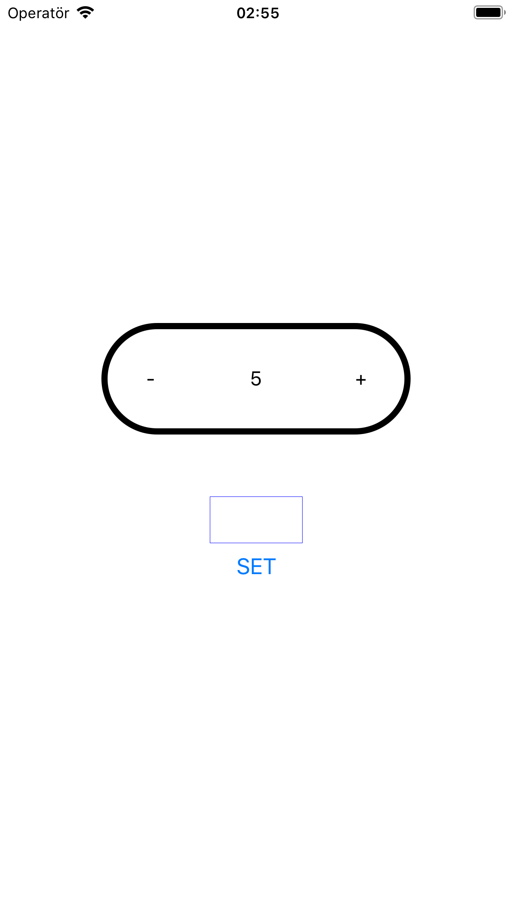

React Native SDK Bridge Example
======================================================

## Description
This is an example of using Native iOS (Swift) and Android (Java) code together with a React
Native Application using Native Modules. 

More info about Native Modules: [iOS](https://reactnative.dev/docs/native-modules-ios) [Android](https://reactnative.dev/docs/native-modules-android)

## What it does

Here we have a simple screen that has a counter. It starts with an initial value, and it is
possible to increment/decrement the value by using buttons, or set it directly using the input.


 
## How it works

React Native side only makes calls to the Native side for making changes
to the value, it is Native (i.e. SDK) side which actually does the operations.

For instance, in order to increment the value
```javascript
SDK.increaseValue()
```
method is used. This call corresponds to following in iOS platform ([SDK/Counter.swift](ios/SDK/Counter.swift)):
```swift
  open func increaseCount() {
    self.countValue += 1
  }
```
and following in Android platform ([sdk/Counter.java](android/app/src/main/java/com/app/sdk/Counter.java)):
```java
    public void increaseCount() {
        this.countValue++;
    }
```

**Note:** React Native works cross-platform. This means that when developing
platform specific SDK, Android and iOS should follow the same rules, such as
method names and parameters should be _exactly_ the same, otherwise 
maintenance in RN side will be cumbersome.

### Getting data from Native to RN

Feting initial count value is a good example for this. Check the following iOS example:

 ```swift
  // SDK/Counter.swift

  open func getCountValue() -> Int {
    return self.countValue
  } 

  // Bridges/SDKModule.swift

  var counterInstance = Counter()

  ...

  @objc
  open func getCountValue(_ resolve: @escaping RCTPromiseResolveBlock, rejecter reject: @escaping RCTPromiseRejectBlock) {
    resolve(self.counterInstance.getCountValue());
  }

  ...
```
Here bridge file calls SDK's `getCountValue` method and returns to RN asynchronously.
The same applies for Android as well:

```java
    // sdk/Counter.java

    public int getCountValue() {
        return this.countValue;
    }

    // Bridge/SDKBridgeModule.java

    private Counter counterInstance = new Counter();

    ...

    @ReactMethod
    public void getCountValue(final Promise promise) {
        promise.resolve(counterInstance.getCountValue());
    }

    ...

``` 

In the end, RN side only does the following:
```typescript
    import {NativeModules} from 'react-native';

    const {SDKModule} = NativeModules;

    class SDK{

        public static getCountValue(): Promise<number> {
            return SDKModule.getCountValue();
        }

        ...
    }
```
Annotations `@objc` and `@ReactMethod` are needed for bridging, but SDK side
does not care about how data is handled by bridges. SDK side focuses *only*
on operating on its own work, which is in this case managing the count value.

### Sending data from RN to Native

Incrementing, decrementing and setting the count value are all examples 
for this but let's examine setting the count value since we will have
chance to see sending parameters as well.

iOS example:
 ```swift
  // SDK/Counter.swift
  
  open func setCountValue(_ value: Int) {
    self.countValue = value
  } 

  // Bridges/SDKModule.swift

  var counterInstance = Counter()

  ...
  
  @objc
  open func setCountValue(_ value: Int) {
    self.counterInstance.setCountValue(value)
    sendCountValue()
  }

  ...
```

Android example:
```java
    // sdk/Counter.java
    
    public void setCountValue(int countValue) {
        this.countValue = countValue;
    }

    // Bridge/SDKBridgeModule.java

    private Counter counterInstance = new Counter();

    ...

    @ReactMethod
    public void setCountValue(int value) {
        this.counterInstance.setCountValue(value);
        this.sendCountValue();
    }
    ...

```

And RN side calls as following:
```typescript
    import {NativeModules} from 'react-native';

    const {SDKModule} = NativeModules;

    class SDK{
        
        public static setCountValue(countValue: number) {
            SDKModule.setCountValue(countValue);
        }

        ...
    }
```

### Sending data from Native to RN

React Native side listens for events, This way, whenever something happens
native side and RN needs to know, events are fired and since RN listens
to them, it will receive necessary data. 

Count value is always (except first run) changed in result of event called `onNewCountValue` being fired.
Let's see iOS side:

 ```swift

  // Bridges/SDKModule.swift

  var counterInstance = Counter()
  
  @objc
  open override func supportedEvents() -> [String] {
    return ["onNewCountValue"] // This is only needed for iOS
  }

  ...
    
  open func sendCountValue() {
    let body = ["countValue" : self.counterInstance.countValue]
    self.sendEvent(withName: "onNewCountValue", body: body)
  }

  ...
```

Android side:
```java
    // Bridge/SDKBridgeModule.java

    private Counter counterInstance = new Counter();

    ...

    private void sendCountValue() {
        WritableMap body = Arguments.createMap();
        body.putInt("countValue", counterInstance.getCountValue());
        this.getEventEmitter().emit("onNewCountValue", body);
    ...

```

Finally, RN side:
```typescript

    ...

    const nativeEventListener = Platform.select({
        ios: () => new NativeEventEmitter(SDKModule),
        android: () => DeviceEventEmitter,
        },
    )();
    
    const sub = nativeEventListener.addListener('onNewCountValue', body => {
        dispatch(setCountAction(body.countValue));
    });

    ...
```
Examples above also shows parameter passing.

### Compiling and Going Live

React Native are Native apps too. They compile and run the same way 
Native apps do. Only difference is there will be a compiled js bundle added to
the app's files.

Going live is just the same in iOS and Android. 
